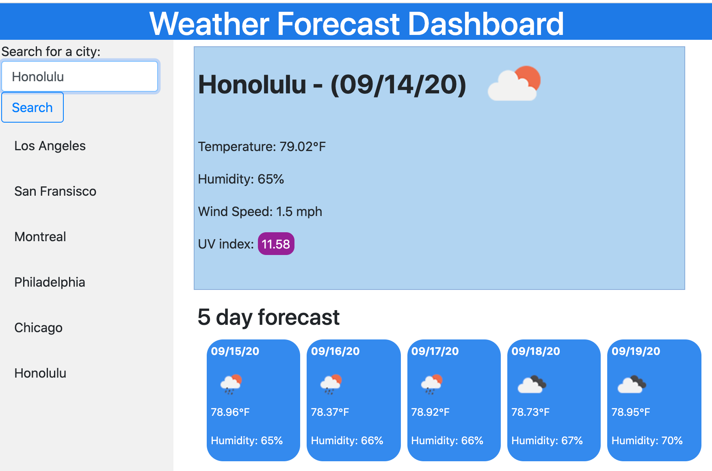

# WeatherDashboard

## Description
Weather dashboard display provides weather information for a designated city within using openweathermap API to call on data that is provide for current weather and 5 day forecast of a given city. 

It also allows for search history and being able to click on the city that was already searched using local storage for providing historical data of searches.

Weather dashboard also dynamically displays the UV index ratings in accordance to the different levels withint the UV index and appropriately assigns the right shade of the index where green is lowest and purple is the highest.

## Snapshot Preview

## Installation &/or Operation

- Type in a city in the search bar and click on search
- It should return data of the current weather for the city entered
- As well as current date and date for the 5 day forecast
- Click on any link on the sideline to be introduced to the same data for the cities that have been previously entered in search input box.

## Usage 

* Introducing APIs
* Localstorage
* On click functions
* Various if statements
* jquery attribute changes 

## Attributes

[Moment.js](http://www.momentjs.com)

[Open Weather Map](http://openweathermap.org/api)

## Links

 https://seykoplik.github.io/WeatherDashboard/

--- 
© 2020 Seychelle Koplik